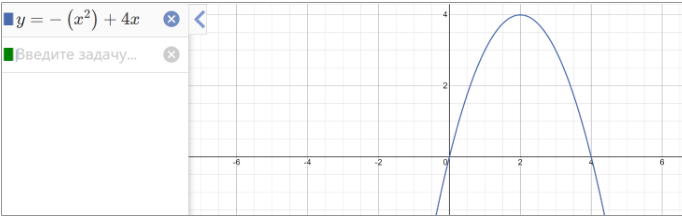

Проводятся секретные испытания новой интеллектуальной межконтинентальной баллистической ракеты «Колокольчик». Эта ракета умеет по ходу движения уточнять и перепросчитывать свою траекторию до цели в зависимости от корректировок со спутника и от воздействия внешних условий среды.
Необходимо провести стресс-тест системы обмена сообщениями между ии-ракеты, центром принятия решений, системой навигации и связи со спутниками. Испытание засекречено под кодовым названием: «По ком звонит Колокольчик»
Задача
1.	Взять реализацию lock-free стека из лекции и добавить в свой проект. Разрешается изменить CAS получения указателя на начало стека на более оптимальное решение. А также изменить на более оптимальное удаление мусора  (см. лекции). Но оптимизировать и менять код не обязательно!
2.	 В качестве типа данных передаются координаты ракеты следующего вида:
```
struct Position{
 double x;
 double y;
}; 
```
Координаты задаются параболой, представленной на изображении снизу.

Ракета стартует из точки P1(0,0), и приземляется в точку P2(4, 0)
Пишущий поток должен генерировать последовательно точки параболы на отрезке [P1 P2]. 
3.	Для тестирования пишущий поток должен добавлять сгенерированные точки в стек, удалять произвольное количество точек из стека, и снова добавлять произвольное количество. Последовательность точек задается значениями x от 0 до 4. Шаг выбирается произвольно, либо задается заранее.
4.	Читающие потоки. Сгенерировать кол-во читающих потоков не менее 4х. Каждый читающий поток должен обращаться к стеку за чтением самой последней версии. Каждая прочтенная версия стека должна проверяться на консистентность. 
Что является консистентностью? 
	Каждая точка принадлежит уравнению на рис. выше. Т.е. при подставлении значения Х точки в уравнение, мы должны получить Y.
	Должна соблюдаться линейная последовательность по оси Ox с постоянным шагом. Т.к. в стеке первый элемент, это последний добавленный, то значение координаты Х должно уменьшаться на константу равную размеру заданного шага. (В лекционном примере каждый последующий элемент отличается от предыдущего на -1) 
5.	Провести эксперимент. Запустить lockfree стек с вашим тестом. Составить подробный отчет, в котором отражено:
a.	Параметры составленного теста. Как выбирался шаг по оси Ox. Как проверяется консистентность данных.
b.	Сколько версий успел создать пишущий поток. 
c.	Сколько в среднем оперативной памяти заняла программа. (Для тех у кого macos, этот пункт можно пропустить)
d.	Количество читающих потоков. Сколько версий смог прочесть каждый из потоков.

В итоге ваша задача, это повторить эксперимент из лекции. Код lock-free стека взять из видео. Самостоятельная часть работы: 
Подставить тип данных struct Position. Переделать генерацию данных согласно пункту 2. Написать свою функцию проверки данных. Запустить решение и составить отчет.
